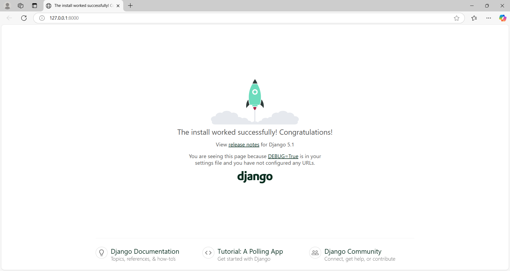

# CocoBlogs - Backend

This is the backend for a personal blogging project built with Django. It provides a RESTful API for managing blog posts, user authentication, and other features.

## Table of Contents

- [Features](#features)
- [Requirements](#requirements)
- [Installation](#installation)
- [Usage](#usage)
- [API Endpoints](#api-endpoints)
- [Contributing](#contributing)
- [License](#license)

## Features

- User authentication and authorization
- CRUD operations for blog posts
- Comment system
- Tagging system
- Pagination for blog posts
- Admin interface for managing content

## Requirements

- Python 3.13+
- Django 5+
- Django REST Framework

## Installation

1. Clone the repository:
    ```bash
    git clone https://github.com/AfshanAlamEngg/coco-blogs-backend
    cd coco-blogs-backend
    ```

2. Create and activate a virtual environment:
    ```bash
    python -m venv venv
    source venv/bin/activate
    ```
    If the above code not works, then try the below code.
    ```bash
    python -m venv venv
    source venv/Scripts/activate
    ```

3. Install the dependencies:
    ```bash
    pip install -r requirements.txt
    ```

4. Run the migrations:
    ```bash
    python manage.py migrate
    ```

5. Create a superuser:
    ```bash
    python manage.py createsuperuser
    ```

6. Start the development server:
    ```bash
    python manage.py runserver
    ```

## Final Output



## Usage

You can access the API endpoints using tools like [Postman](https://www.postman.com/) or [cURL](https://curl.se/). The admin interface can be accessed at `/admin/`.

## API Endpoints

- `GET /api/posts/` - List all blog posts
- `POST /api/posts/` - Create a new blog post
- `GET /api/posts/{id}/` - Retrieve a specific blog post
- `PUT /api/posts/{id}/` - Update a specific blog post
- `DELETE /api/posts/{id}/` - Delete a specific blog post
- `POST /api/comments/` - Add a comment to a blog post

## Contributing

Contributions are welcome! Please open an issue or submit a pull request for any improvements or new features.

## License

This project is licensed under the MIT License. See the [LICENSE](LICENSE) file for more details.
